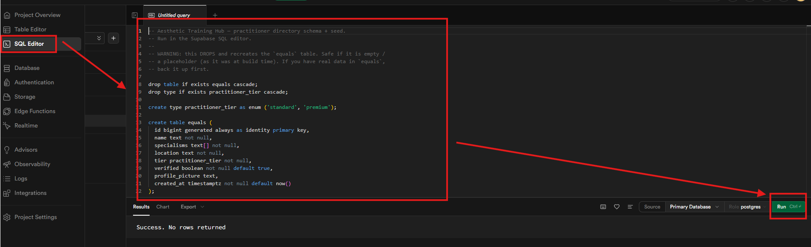

# Aesthetic Training Hub — Practitioner Directory

**Live version**: https://equals3-test-one.vercel.app/


## 1. How to run

**Prerequisites:** Node 20+, a Supabase project.

1. **Set the Environment** `.env.local` needs:
   ```
   NEXT_PUBLIC_SUPABASE_URL=https://<project>.supabase.co
   NEXT_PUBLIC_SUPABASE_ANON_KEY=<your-anon-key>
   ```

2. **Database** — open the Supabase **SQL editor** and run [`supabase/seed.sql`](supabase/seed.sql).
   It creates the `practitioner_tier` enum, the `equals` table, a public
   read-only RLS policy, and inserts 30 seed trainers. (Re-running requires
   dropping the table/type first.)
   
   

3. **Install + run**
   ```bash
   npm install
   npm run dev        # http://localhost:3000
   ```


---

## 2. Progress report

### Built
- directory page
- filters
- premium parctitioner standout

### Left out
- none 

### What I'd do next
- detail modal
- search by text
- profile picure

**Note**: I used AI to accelerate boilerplate generation and regex filtering logic, but the architecture and component design were manually implemented to ensure maintainability.

---

## 3. Where the brief was unclear or wrong

the briefing was clear except on the following 
- specialisms, it would be good if we provide a list of specialisms to be applied, this is important as this will be added as an enum/type for strict typing,